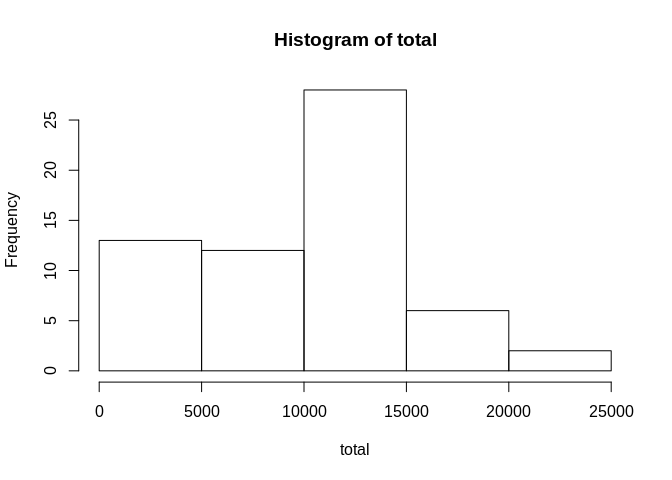

## Loading and preprocessing the data
The script will run, if working directory set in the same place, where this script is located

```r
unzip(zipfile = "activity.zip")
data<- read.csv('activity.csv')
```

## What is mean total number of steps taken per day?

```r
total<- tapply(data$steps, data$date, sum, na.rm = TRUE)
hist(total)
```

<!-- -->


```r
print(paste("Mean: ", mean(total)))
```

```
## [1] "Mean:  9354.22950819672"
```

```r
print(paste("Median: ", median(total)))
```

```
## [1] "Median:  10395"
```

## What is the average daily activity pattern?

```r
means<-aggregate(data$steps, by = list(data$interval), mean, na.rm = TRUE)
plot(means, type = 'l', xlab = 'Time(5-minut interval)', ylab = 'Average number of steps')
```

<!-- -->


```r
means[which.max(means$x),]
```

```
##     Group.1        x
## 104     835 206.1698
```


## Imputing missing values

```r
table(is.na(data))
```

```
## 
## FALSE  TRUE 
## 50400  2304
```

Although, filling missing vallue with mean may introduce bias to the dataset and it's better to use more sophisticated methods, like MICE(Multiple Imputation by Chained Equations) or KNN (K-Nearest-Neighbors), for the sake of demonstration, I will use mean imputation for 5-minute interval


```r
filled <- data 
for (i in 1:nrow(filled)) {
    if (is.na(filled$steps[i])) {
        filled$steps[i]<-means[which(filled$interval[i] == means$Group.1),]$x
    }
}
```

Now, let's make a histogram with filled missing values. And see mean and median values.

```r
total<- tapply(filled$steps, filled$date, sum)
hist(total)
```

<!-- -->


```r
print(paste("Mean: ", mean(total)))
```

```
## [1] "Mean:  10766.1886792453"
```

```r
print(paste("Median: ", median(total)))
```

```
## [1] "Median:  10766.1886792453"
```
We can see that imputing data makes distribution of data more normal, I would say it's not really a good thing, because we introduced bias in the dataset. Median became equal to the mean. 

## Are there differences in activity patterns between weekdays and weekends?
I will create a vector in my dataframe, indicating whether it is a weekday or not. Since my locale_time os different, I am using different words for checking a weekend


```r
filled$weekend <- 'Weekday'
for (i in 1:nrow(filled)) {
    if (weekdays(as.Date(filled$date[i]))=="ишемби" || weekdays(as.Date(filled$date[i])) == "жекшемби") {
        filled$weekend[i]<-'Weekend'
    }
}
```
Now, let's make a panel plot containing plots of average number of steps taken on weekdays and weekends.


```r
library(ggplot2)
means <- aggregate(steps ~ interval + weekend, data = filled, mean)
ggplot(means, aes(interval, steps)) + geom_line() + facet_grid(weekend ~ .) + 
    xlab("5-minute interval") + ylab("Number of steps")
```

<!-- -->
